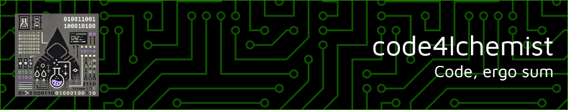
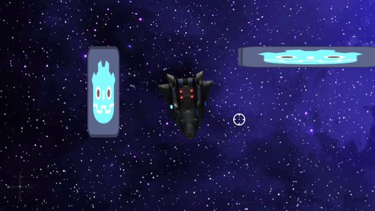
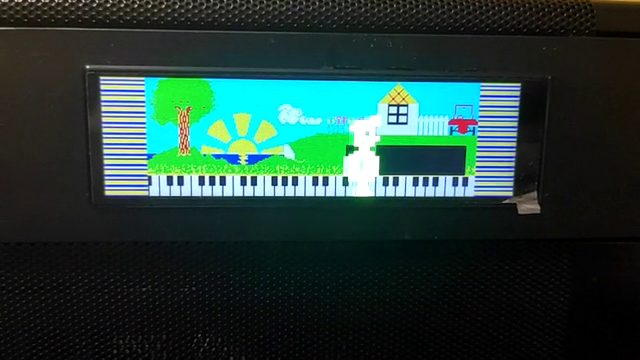

# 

## About me

I have been a full-stack web developer since 2009, with a strong foundation in self-taught skills and incomplete formal studies in computer science. My passion for technology has driven me to constantly learn and refine my expertise in various web development technologies.

In 2021, I transitioned into the public sector, joining the General Administration of the State as an IT Assistant. This shift paused my professional coding journey until recently, when I secured a position at the Central Traffic Headquarters, where I aim to continue developing and expanding my skill set.

## Previous Experience

- **Regional Assembly of Murcia (2009 - 2017)**  
*Full-Stack Developer*
- **DIGIO Soluciones Digitales, SL (2017 - 2019)**  
*Full-Stack Developer*

- **TICARUM SLU MP (2019 - 2021)**  
*Programmer Analyst*

- **Subdelegation of the Government in Castellón (2021 - 2024)**  
*IT Assistant*

- **Central Traffic Headquarters (2024 - )**  
*Technical Support Operator*

## Collaborated Projects

Throughout my career, I have had the opportunity to collaborate on various projects. Below are a few selected projects I've been involved with:

- [Regional Assembly of Murcia website](https://www.asambleamurcia.es)
    - Main technology used in the project: **Drupal 7 (PHP)**
- [Symposium Event Management Portal](https://symposium.events)
    - Main technology used in the project: **Codeigniter (PHP)**
- [CF Damm Team Portal](https://www.cfdamm.cat/es)
    - Main technology used in the project: **Drupal 8 (PHP)**
- [Victoria Beer Website](https://www.cervezavictoria.es/es)
    - Main technology used in the project: **Drupal 8 (PHP)**
- [Scientific Journals Portal of the University of Murcia](https://revistas.um.es)
    - Main technology used in the project: **OJS 3 (PHP)**

## Personal Interests

I love videogames and I am currently exploring game development using <a href="https://godotengine.org/">Godot</a>, where I enjoy the creativity and challenges that come with building immersive experiences.

Additionally, I have a passion for programming on the <a href="https://www.arduino.cc/">Arduino platform</a>, allowing me to create innovative projects that blend technology with everyday life.

In my spare time, I indulge in the nostalgia of retro consoles and 8-bit microcomputers from the '80s, particularly the ZX Spectrum. I appreciate the artistry and gameplay that defined that era. I also enjoy playing the classical guitar, despite not being an expert. Music serves as a wonderful outlet for expression and relaxation, complementing my technical pursuits.

### Technologies I'm Interested In

| Technology | Reason                                         |
| :--------: | :--------------------------------------------- |
| PHP        | I like PHP, especially for backend development. |
| Symfony    | I like Symfony as a PHP framework because of its vast ecosystem of small components. |
| Node.js    | I like Node.js for backend development because of its vast ecosystem and seamless integration with the frontend. |
| Vue        | Vue is perfect as a powerful and lightweight framework for frontend development. |
| C++        | C++ is my go-to language for maximizing optimization in development, as is often required in applications for microcontrollers like Arduino or ESP32. |
| Go         | Go is simple and efficient, and I love its concurrency handling. It's ideal for small microservices development. |
| Godot      | Programming games with this IDE/framework is a lot of fun. |

## Contact

You can contact me using the forums for the subject Markup Languages and Information Management Systems in the Higher Degree Cycle of Web Application Development.

:memo: **Note:** As you may have guessed, this profile is an exercise for the subject Markup Languages and Information Management Systems in the Higher Degree Cycle of Web Application Development.

---

[⇈ Go up ⇈](#) 

